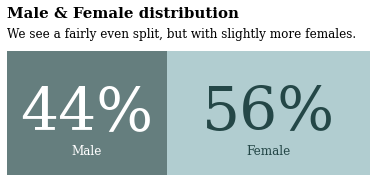
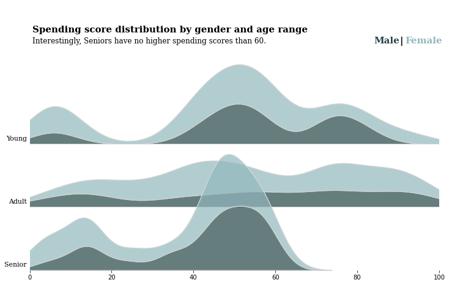
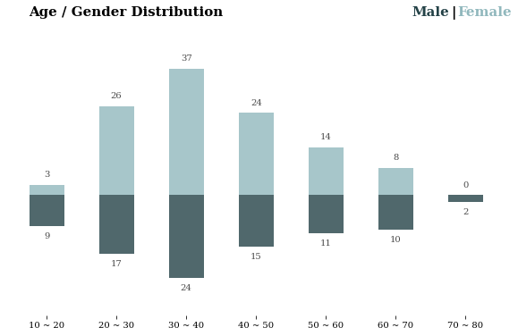
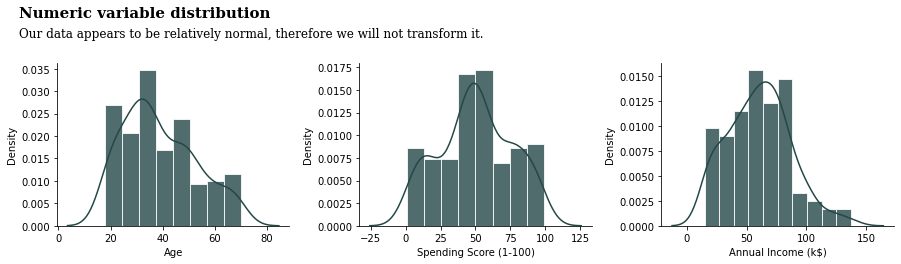
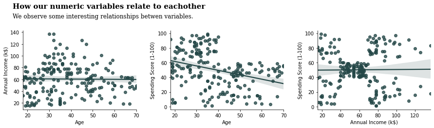
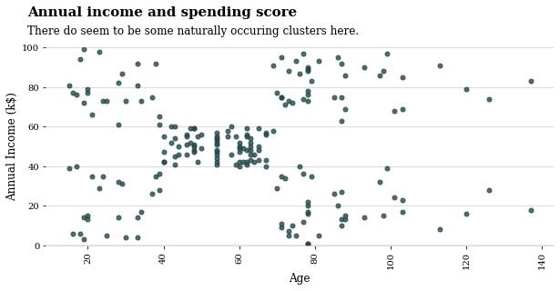
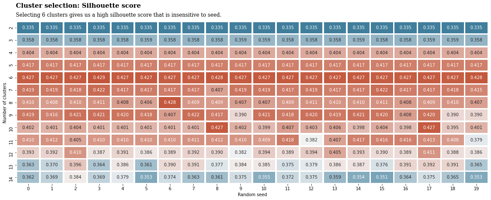
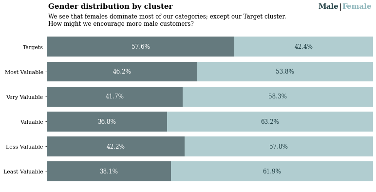
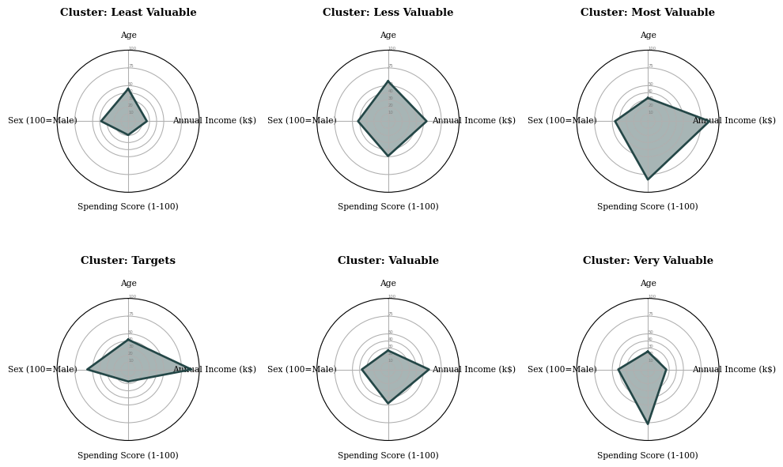
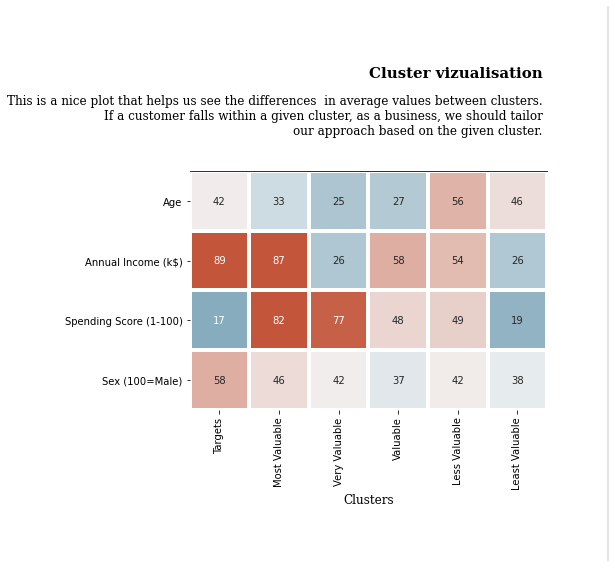

# Customer Segmentation using K-means clustering

One of the key challenges that marketing teams must solve is allocating their resources in a way that minimizes “cost per acquisition” (CPA) and increases return on investment. This is possible through segmentation, the process of dividing customers into different groups based on their behavior or characteristics.

Customer segmentation can help reduce waste in marketing campaigns. If you know which customers are similar to each other, you’ll be better positioned to target your campaigns at the right people.

Customer segmentation can also help in other marketing tasks such as product recommendations, pricing, and up-selling strategies.

# Data Source and Preperation

Dataset is data-visualization-clustering-mall-data from Kaggle Dataset 

You are owing a supermarket mall and through membership cards , you have some basic data about your customers like Customer ID, age, gender, annual income and spending score.
Spending Score is something you assign to the customer based on your defined parameters like customer behavior and purchasing data.

In Data cleaning and preparation, We clean the dataset and we handle the categorical variables into machine learning format (Check the Jupyter notebook)

## Exploratory Data Analysis

## 1. Male and Female Distribution

## 2. Spending Score Distribution by gender and age range

## 3. Age and Gender distribution

## 4. Numeric Variabilty Distribution

## 5. How are numeric variables related to each other

## 6. Annual income and spending score

# Clustering the data

1. We use "from sklearn.preprocessing import StandardScaler" to normalize the all the values 

2. We use Silhouette score. 

## Silhouette score concepts: 

Silhouette score for a set of sample data points is used to measure how dense and well-separated the clusters are.
Silhouette score takes into consideration the intra-cluster distance between the sample and other data points within the same cluster (a) and inter-cluster distance between the sample and the next nearest cluster (b).
The silhouette score falls within the range [-1, 1].
The silhouette score of 1 means that the clusters are very dense and nicely separated. The score of 0 means that clusters are overlapping. The score of less than 0 means that data belonging to clusters may be wrong/incorrect.
The silhouette plots can be used to select the most optimal value of the K (no. of cluster) in K-means clustering.
The aspects to look out for in Silhouette plots are cluster scores below the average silhouette score, wide fluctuations in the size of the clusters, and also the thickness of the silhouette plot.

## Cluster Selection: Silhouette Score

3. We cluster into 6 clusters

# Exploring our Clusters

## 1. Gender Distribution by Cluster

## 2. Clusters "Least" & "Most" Valuable

## 3. Main Cluster visualization

# License
This code pattern is licensed under the Apache Software License, Version 2.  Separate third party code objects invoked within this code pattern are licensed by their respective providers pursuant to their own separate licenses. Contributions are subject to the [Developer Certificate of Origin, Version 1.1 (DCO)](https://developercertificate.org/) and the [Apache Software License, Version 2](https://www.apache.org/licenses/LICENSE-2.0.txt).

[Apache Software License (ASL) FAQ](https://www.apache.org/foundation/license-faq.html#WhatDoesItMEAN)
